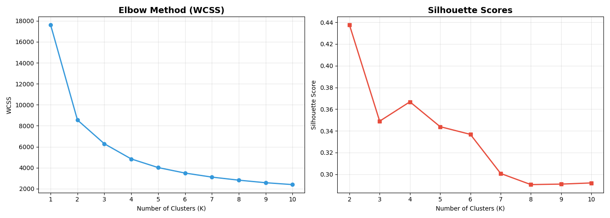
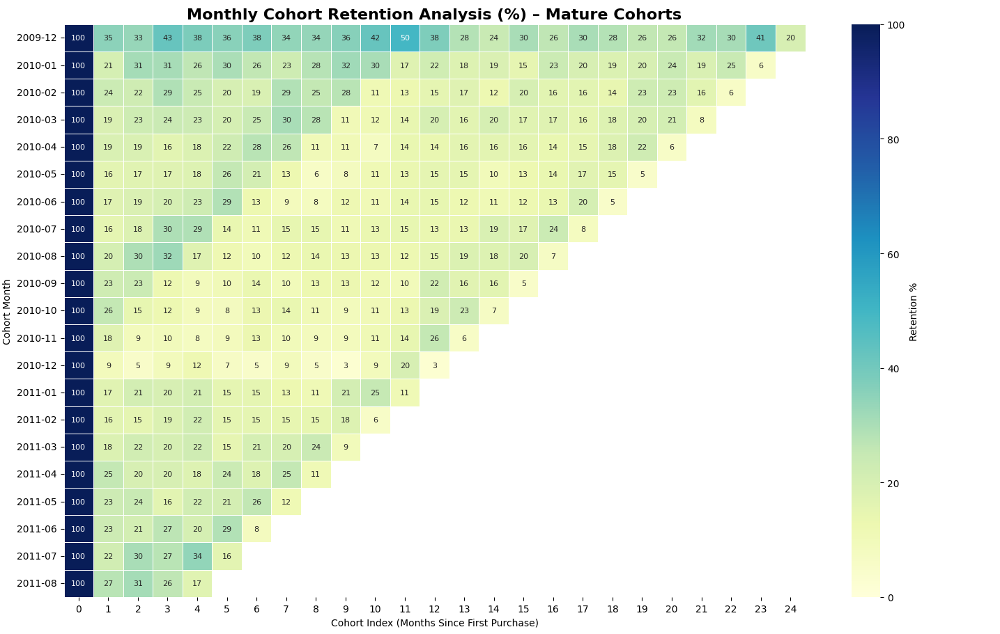
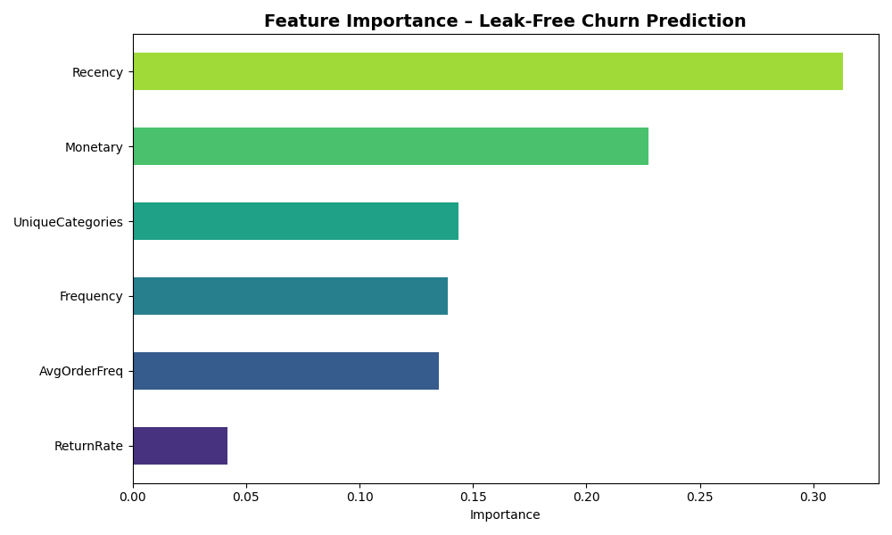

# Customer Analytics: Segmentation, CLV, and Churn Prediction

This repository provides an end-to-end customer analytics pipeline. It processes transaction data to perform RFM segmentation, predicts future Customer Lifetime Value (CLV), analyzes retention cohorts, and uses machine learning to identify customers at risk of churn.

## Project Overview

The analysis is driven by a multi-stage analytical pipeline designed to convert raw transactional logs into strategic business decisions.

## Dataset

> [!IMPORTANT]  
> **Manual Data Setup Required:** Due to file size limitations, the dataset is **not** included in this repository. You must download and place it manually to run the analysis.

1. **Download:** Get the "Online Retail II" dataset from the [UCI Machine Learning Repository](https://archive.ics.uci.edu/dataset/502/online+retail+ii).
2. **Rename:** Ensure the downloaded file is named exactly **`online_retail_II.xlsx`**.
3. **Placement:** Place the file in the root directory of this project (the same folder as the script).


---
## Technical Stack

* **Language:** Python 3.8+
* **Data Analysis:** `pandas`, `numpy`
* **Modeling:** `scikit-learn` (K-Means, Random Forest), `lifetimes` (BG/NBD, Gamma-Gamma)
* **Visualization:** `matplotlib`, `seaborn`, `plotly`

---

### 1. Data Preprocessing & Feature Engineering
* **Cleaning:** Removal of transactions without Customer IDs and filtering out non-positive quantities or prices.
* **Return Management:** Isolation of cancelled orders (Invoices starting with 'C') to calculate a specialized **Return Rate** feature for the churn model.
* **Outlier Suppression:** Implementation of percentile capping (1st and 99th percentiles) for `Quantity` and `Price` to stabilize statistical variance while preserving total data volume.
* **Feature Engineering:** Derivation of complex metrics such as **Average Order Frequency**, **Product Variety (Unique Categories)**, and **Transaction Intervals**.

### 2. Strategic RFM Segmentation
* **Data Normalization:** Application of `Log1p` transformation to handle the heavy-tailed distribution of retail spending, followed by `StandardScaler` to ensure feature parity for K-Means.
* **K-Means Clustering:** Segmenting customers into distinct behavioral groups to tailor marketing strategies.

### 3. Predictive CLV (BG/NBD & Gamma-Gamma)
* **Transaction Forecasting (BG/NBD):** Modeling the "buy-till-you-die" process to estimate the expected number of purchases in a 6-month horizon.
* **Spend Modeling (Gamma-Gamma):** Estimating the conditional expected average profit per transaction for repeat customers.
* **Valuation:** Compiling these models into a discounted 6-month CLV projection.

### 4. Time-Series Cohort Analysis
* **Retention Tracking:** Grouping customers by their acquisition month to observe loyalty decay over time.
* **Maturity Filtering:** Application of a 4-month maturity filter to the cohort matrix to prevent incomplete recent data from skewing long-term retention benchmarks.

### 5. Leak-Free Churn Classification
* **Temporal Splitting:** Simulating real-world conditions by splitting data into an **Observation Window** (for feature extraction) and a **Performance Window** (for churn verification).
* **Predictive Modeling:** Training a **Random Forest Classifier** (n_estimators=200, max_depth=10) to generate risk probabilities for every customer account.

---


## Visual Outputs & Insights

### 1. K-Means Optimization (Elbow & Silhouette)
The project utilizes two objective metrics to define the optimal number of clusters ($K$):
* **Elbow Method:** Measures the Within-Cluster Sum of Squares (WCSS). We look for the "point of inflection" where additional clusters yield diminishing returns in error reduction.
* **Silhouette Score:** Measures how similar an object is to its own cluster compared to other clusters. A higher score indicates well-defined, separated segments.



### 2. Mature Cohort Retention Heatmap
This visualization reveals the percentage of customers returning in subsequent months after their first purchase:
* **Insight:** Identifying high-churn "valleys" (months 1-3) helps in designing early-intervention loyalty programs.
* **Maturity Logic:** Only cohorts with at least 4 months of history are visualized to ensure a "fair comparison" across different acquisition periods.



### 3. Churn Feature Importance
This chart identifies the behavioral "DNA" of a churning customer:
* **Key Predictors:** High **Recency** (days since last purchase) and a spike in **Return Rate** often serve as the strongest leading indicators of churn.
* **Business Value:** By understanding *why* customers leave, the business can proactively adjust its service or pricing models.



### 4. Business Action Matrix (Quad Analysis)
The core decision-making tool of this project, mapping **Churn Risk** against **Customer Value (Monetary)**:
* **Top Priority (High Value / High Risk):** Customers who represent significant revenue but are likely to leave. These require immediate, high-touch retention efforts.
* **Loyal (High Value / Low Risk):** Your best customers; they should be rewarded and enrolled in VIP programs.
* **Revenue at Risk:** The matrix automatically quantifies the total monetary value residing in the "Top Priority" segment, creating a clear financial case for retention investment.
[!TIP]
> **View Interactive Matrix:** [Live Business Action Matrix](https://aem0n.github.io/CLV-Modeling-Churn-Analysis/business_action_matrix.html)


---

## Setup and Usage

### Installation
Install the necessary dependencies using terminal:
```bash
pip install -r requirements.txt
python analysis_main.py
```
